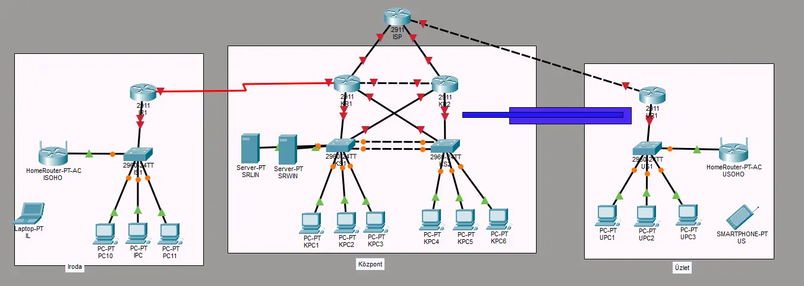

# Projekt terv - Lossó Bálint, Pásztor Dávid, Pintér Soma

**Topológia**

**Címzési Táblázat**

|Eszköz|Interface|Cím|Default Gateway|
| :----: | :-----: | :-----: | :---: |
| ISP | G0/0 
 G0/1 | 9.11.69.65/30 
 9.11.69.70/30 |  |
| KR1 | G0/4 
 G0/0.10 
 G0/0.20 
 G0/0.30 
 G0/0.88 
 G0/0.100 
 G0/1.10 
 G0/1.20 
 G0/1.30 
 G0/1.88 
 G0/1.100 
 G0/2.10 
 G0/2.20 
 G0/2.30 
 G0/2.88 
 G0/2.100 
 G0/3.10 
 G0/3.20 
 G0/3.30 
 G0/3.88 
 G0/3.100 
 S0/0/0 |9.11.69.69/30 
(HSRP) 192.168.10.1/24 
 (HSRP) 192.168.20.1/24 
 (HSRP) 192.168.30.1/24 
 (HSRP) 192.168.88.1/24 
 (HSRP) 192.168.100.1/24 |  |
| KR2 | G0/4 
 G0/0.10 
 G0/0.20 
 G0/0.30 
 G0/0.88 
 G0/0.100 
 G0/1.10 
 G0/1.20 
 G0/1.30 
 G0/1.88 
 G0/1.100 
 G0/2.10 
 G0/2.20 
 G0/2.30 
 G0/2.88 
 G0/2.100 
 G0/3.10 
 G0/3.20 
 G0/3.30 
 G0/3.88 
 G0/3.100 
 S0/0/0 |9.11.69.66/30 
(HSRP) 192.168.10.1/24 
 (HSRP) 192.168.20.1/24 
 (HSRP) 192.168.30.1/24 
 (HSRP) 192.168.88.1/24 
 (HSRP) 192.168.100.1/24 |  |
| IR1 | S0/0/0 
 G0/0.10 
 G0/0.20 
 G0/0.30 
 G0/0.60 | 192.168.50.2/30 
 192.168.10.2/24 
 192.168.20.2/24  
 192.168.30.2/24 
 192.168.60.1/24  |
| UR1 | G0/0.10 
 G0/0.20 | 192.168.10.1/24 
 192.168.20.1/24 |  |
| ISOHO | WAN 
 WLAN | 192.168.60.2/24 
 192.168.100.1 | 192.168.60.1 |
| USOHO | WAN 
 WLAN | 192.168.20.2/24 
 192.168.100.1 | 192.168.20.1 |
| SEWIN | eth0 | 192.168.100.253 | 192.168.100.1 |
| SELIN | eth0 | 192.168.100.254 | 192.168.100.1 |
| KS1 | VLAN88 | 192.168.88.2/24 | 192.168.88.1 |
| KS2 | VLAN88 | 192.168.88.3/24 | 192.168.88.1 |
| AS1 | VLAN88 | 192.168.88.4/24 | 192.168.88.1 |
| US1 | VLAN88 | 192.168.88.5/24 | 192.168.88.1 |
| IPC1 | eth0 | DHCP | DHCP |
| IPC2 | eth0 | DHCP | DHCP |
| IPC3 | eth0 | DHCP | DHCP |
| KPC1 | eth0 | DHCP | DHCP |
| KPC2 | eth0 | DHCP | DHCP |
| KPC3 | eth0 | DHCP | DHCP |
| KPC4 | eth0 | DHCP | DHCP |
| KPC5 | eth0 | DHCP | DHCP |
| KPC6 | eth0 | DHCP | DHCP |
| UPC1 | eth0 | DHCP | DHCP |
| UPC2 | eth0 | DHCP | DHCP |
| UPC3 | eth0 | DHCP | DHCP |
| IL | w0 | DHCP | DHCP |
| UP | w0 | DHCP | DHCP |

**Telephelyek**
- Központ
	- Feladata kiszolgálni a többi telephelyet, a folyamatos szolgáltatás elérés érdekében, 2. és 3. rétegbeli redundanciával rendelkezik.
	- A biztonságos WAN kapcsolat érdekében, minden telephely *tűzfallal* csatlakozik az *ISP* felé.
	- Az *ISP* felé történő, illetve az onnan befelé jövő kommunikáció *tűzfal*lal van védve, illetve a határforgalomirányítón *BGP* fut.
	- Az irodai és központi felhasználók bejelentkezését a *Windows Szerver* szolgálja ki.
	- A *Linux szerver*en *webszerver* fut, mely a *Windows Szerveren* futó *DNS*-en keresztül elérhető.
	- A Windows szerveren DHCP szolgáltatás is fut, mely kiszolgál IPv4 illetve IPv6 címeket egyaránt.
	- A forgalomirányítást OSPFv3-al oldottuk meg.
	- A szerverek ISP felé történő kommunikációjáért statikus címfordíást alkalmazunk, a többi kliens dinamikusan kapja a címet.
	- A központban található *VLAN*-ok:
		- Management **88**
		- HR **10**
		- Sales **20**
		- Marketing **30**
		- Blackhole **100**
- Iroda
	- Az éppen a cég által fejlesztett projektek, a központban elhelyezkedő *Linux szerver*en találhatók, melyek kizárólag *VPN* kapcsolaton keresztül érhetők el.
	- A rendszergazda számítógépén futtathatóak a Linux szerveren mentett konfigurációs fájlok, a hálózati eszközök automatizált konfigurációjára.
	- Az irodában található *VLAN*-ok:
		- Management **88**
		- HR **10**
		- Sales **20**
		- Marketing **30**
		- Blackhole **100**
	- A központi *Linux szerver*hez a hozzáférést *ACL* szabályozza.
	- Az irodai dolgozók számára WLAN is biztosítva van. Illetéktelenek személyek csatlakozásának elkerülése érdekében WPA2 Enterprise autentikációt alkalmazunk a Linux szerveren futó **RADIUS szerver**rel összekapcsolva
- Üzlet
 	- Az üzletben a bankkártyás fizetés elérése érdekében *WI-FI* hálózat működik.
	- Az üzleti hálózat automatikus konfigurációval rendelkezik.
	- Az üzletben található *VLAN*-ok:
		- Guest
		- Desktop
	- Az ISP felé történő kommunikációhoz PAT-ot alkalmazunk.

**Windows Szerveren futó szolgáltatások**
- Active Directory, DNS, DHCP, Automatizált szoftvertelepítés, Webszerver

**Linux Szerveren futó szolgáltatások**
- Webszerver, FTP, Adatbázis, Automatizált mentés
